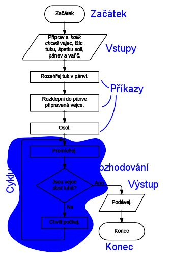
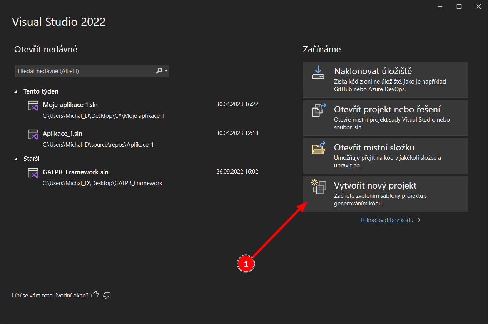
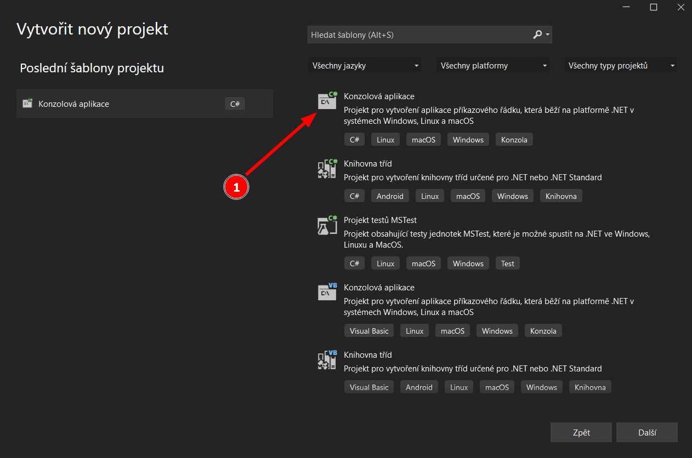
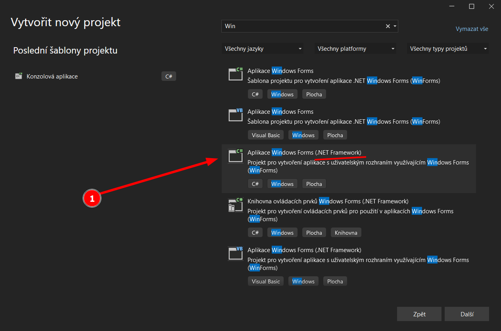
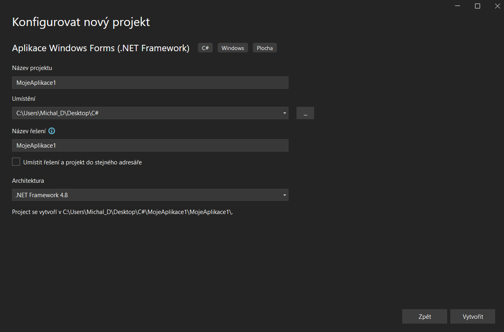
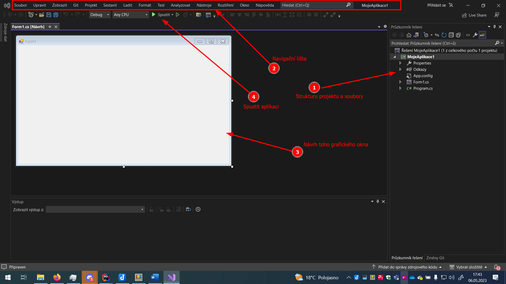
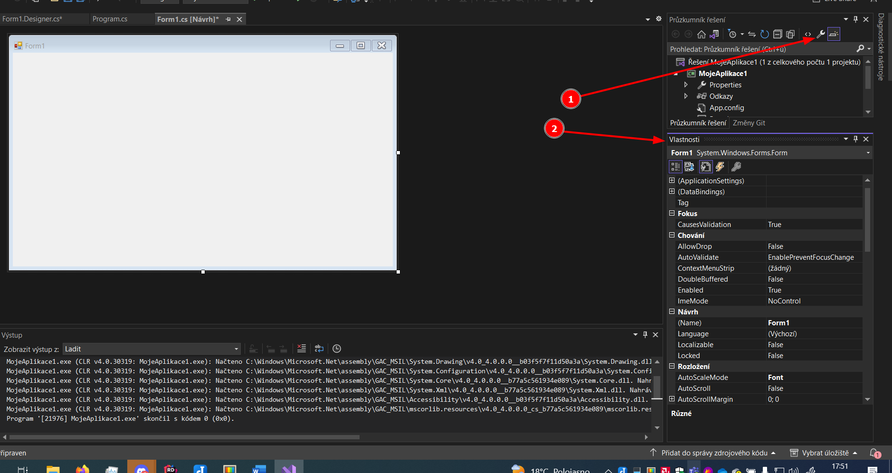
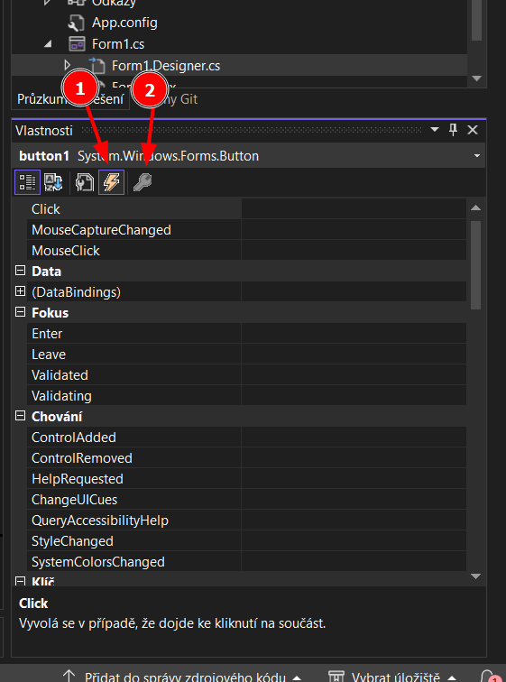

***
***
# 18. Algoritmus
## Algoritmus
Algoritmus je návod, jak provést určitou činnost. S algoritmy se setkáváme
v běžném životě. Například v návodech na ovládání domácích spotřebičů.
## Základní vlastnosti algoritmů
**Elementární** – algoritmus se musí skládat z konečného počtu jednoduchých
činností – kroků, které jsou dále nedělitelné 
**Determinovaný** – po každém kroku lze určit, zda algoritmus skončil nebo
kterým krokem má pokračovat
**Konečný** – algoritmus musí skončit po konečném počtu kroků 
**Rezultativní** – algoritmus musí vést ke správnému výsledku
**Hromadný** – algoritmus můžeme použit k řešení celé skupiny podobných
úloh a znovu ho použít.
***
## Vývojový diagram

Start a konec algoritmu je v elipse nebo oválu.
Vstupní / výstupní data / potřeby jsou v kosodélnících.
Samotné příkazy se nacházejí v obdélnicích. 
Podmínka - kosočtverec.
Cyklus - pokud je možno se dostat zpátky v posloupnosti příkazů, často na základě nějakého větvení.

***
## Programovací paradigmata a jazyky
Programovací paradigma mi říká, jak daný jazyk funguje, na jakém principu je založený a přibližně mi prozrazuje, co očekávat za syntaxi a jak budu konstruovat program, přesněji jakým stylem.

### Procedurální paradigma
- mám čistě proceduru, která se vykonává, ergo nějaký program co běží příkaz po příkazu od shora dolů
- základem je tedy sekvence (blok) příkazů, alternativy (podmínka) a cykly
- např. **C** ( použití v operačních systémech, systémy reálného času; je hodně rychlý), **Cobol, Fortran, Algol, Basic** (Visual Basic - programování ve Wordu, Excelu apod.)

### Funkcionální paradgima
- programy sestaveny ze symbolických výrazů, nepoužívají klasické přiřazení
- mám funkce, které můžu znovu použít a v tom programu je používám opakovaně.
- např. starší jazyk **LISP**
### Objektově orientované paradigma
- základem jsou objekty (což jsou instance třídy), které si mezi sebou zasílají zprávy (požadují po sobě nějakou informaci nebo funkcionalitu)
- programovací jazyky OOP často obsahují tzv. garbage collector, což je hodná paní uklízečka, která se dívá, jestli už nepotřebuji nějakou proměnnou a když ne, tak ji smaže a uvolní místo v paměti.
- např. **C#**, **C++** (OOP verzce jazyka C), **Java** (desktop či server aplikace; je význačná absolutní multiplatormostí), **PHP** (je na webové servery), **Python** (relativně nový jazyk, používají ho především vědci)

### Deklarativní paradigma
- zakládá se na deklaracích, respektive na nějakých deklaracích, formulích a klauzulích, kterými popíšu, co po něm chci, respektive co má být výsledek a jak má vypadat konečný stav, ale to, jak se to provede, to je na tom daném jazyce.
např. **SQL** (databáze)

Ještě je paralelní programování, kdy program je složen z několika souběžně pracujícíh částí.
***
## Překladače
### Kompilátor
- převede zdrojový kód na strojové instrukce a ty na bytekód (binární kód) přímo pro daný procesor nebo platformu. 
- **Výhody** - velká rychost běhu programu, maximální efektivitia a využití schopností daného CPU
- **Nevýhody** - kompilace trvá nějakou dobu a bytekód nemusí být přenositelný na jiný procesor
### Interpret
- bere zdrojový kód a jde příkaz po příkazu a živě ho překládá a sune ho na instrukce pro procesor.
- **Výhody** - nemusím nic kompilovat a kód je přenositelný i na jiná CPU
- **Nevýhody** - je pomalejší a nemusí být tak efektivní

***
***
# 19. Algoritmizace a programování
## Datové typy
Jakákoliv data musím nějak reprezentovat v konečném důsledku v binárním tvaru. Z toho důvodu vznikly datové typy, které mi říkají, jakou mají vnitřní strukturu, jak budou data převedena do bitového zápisu a co všechno za operace mohu s daty dělat (protože logicky nemohu třeba násobit text, zatímco čísla ano).
Základní datové typy:
**boolean** - logická hodnota pravda/nepravda; nabývá hodnot true/false
**integer** - celé číslo reprezentované 4 bajty = 32 bitů => rozsah cca. <-2 mld;+2mld> 
**double** - reprezentace reálného čísla o velikosti 8 bytů
Pozn. pro uložení desetinného čísla se dá použít ještě 4B float, nebo 16B decimal, double je výchozí
**char** - 1 znak, zpravidla z ASCII tabulky
**string** - je text, interně funguje jako řetězec nebo pole znaků
***
## Proměnná 
 - je nějaké místo v paměti, které nějak pojmenuji (abych nemusel pracovat s neintuitivní adresou v paměti)
```cs
bool pravda = true;
bool nePravda = false;

int celeCislo = 2;
int celeCislo2 = -87;

double realneCislo = 5.148935;

string text = "Hele, jsem nějaký text"; // text vždy musím zapsat do uvozovek ""
char znak = 'z'; // znak musím vždy zapsat do apostrofů ''
```
**Deklarace** - řeknu programu, že bude nějaká proměnná. Tím pádem, program vyhradí dopředu paměť, ale musí pro to znát i datový typ proměnné.
```cs
int cislo1;
```
**Přiřazení (inicializace) proměnné** - já ji už dávám nějakou hodnotu, něco do ní ukládám, na to je symbol přiřazení =
```cs
cislo1 = 5;  //inicializace již deklarované proměnní
int cislo2 = 7;  //deklarace s inicializací v jednom kroku
```
***
## Operátory
Operátory dělíme na unární a binární. Binární pracují s 2 hodnotami (2 vstupy), unární pracují nad jednou proměnnou (hodnotou/vstupem).

### Binární operátory
#### Aritmetické
```cs
int cislo3 = cislo1 + cislo2; //operátor sčítání
int cislo4 = cislo2 - cislo3; //operátor odčítání
int cislo5 = cislo1 / cislo2; //operátor dělení
int cislo7 = cislo1 * cislo3; //operátor násobení
int cislo12 = cislo2 % cislo1; //modulo % je zbytek po celočíselném dělení, ergo 7/5 je jedna a zbytek je 2, dva je to modulo
```
#### Složeného přiřazení
```cs
cislo7 = cislo7 + cislo3;
cislo7 += cislo3; //stejný zkrácený zápis řádku výše; analogicky to funguje i pro -=
```
#### Relační operátory
`==` rovno
 `!=` není rovno
 `<=` menší rovno
 `>=` větší rovno
 `<` menší
 `>` větší
 #### Logické operátory
 `||` konjunkce OR – Stačí, aby platil jeden výraz a celá podmínka se bere jakože platí
`&&` disjunkce AND – Musí platit všechny části výrazy v podmínce, aby byla podmínka vyhodnocena jako platná
### Unární operátory
- pracují nad jednou hodnotou/proměnnou
```cs
cislo3 = -cislo3; //záporná hodnota cisla3
cislo4 = +cislo4; //kladná hodnota cisla4
bool pravda1 = true;
bool pravda2 = !pravda1; //negace, funguje jenom nad datovým typem bool
int cislo10 = 1;
int cislo11 = ++cislo10; //zvednu hodnotu o 1, analogicky --; funguje jenom u integeru
```
***
 ## Pole
 Pole nám umožňuje do jedné proměnné ukládat více hodnot. Což se hodí, pokud bych musel mít 500 hodnot zvlášť. Pokud nad nimi dělám hromadné nebo společné operace, hodí se o to víc.
 Pole je tedy struktura u které předem definuji, kolik prvků bude obsahovat a jakého datového typu. Všechny prvky v poli musí mít datový typ stejný.
 Mám 3 možnosti jak deklarovat a inicializovat pole:
 **1.** Deklarace a následně inicializace s vyplněním všech prvků, velikost pole se automaticky určí podle počtu prvků
```cs
int[] pole1;
pole1 = new[] { "Vílém", "Jarmila", "Hynek" };
```
**2.** Deklarace pole s inicializací v jednom kroce
```cs
int[] pole3 = new[] { "Vílém", "Jarmila", "Hynek" };
```
**3.** Deklarace s definicí bez plné inicializace
```cs
string[] pole3 = new string[3]; //deklarace pole s definicí, kdy já říkám, jak bude velké, ale ještě tam nedávám ty hodnoty, nicméně pole jako takové již existuje
```
Následně ale musím pole naplnit ručně, kdy na jednotlivé indexy (políčka) uložím jednotlivé hodnoty. 
```cs
pole2[0] = "Maryje";
pole2[1] = "Karla";
pole2[2] = "Zbyněk";
//pole2[3] = "Anežka"; už nebude fungovat, pole2 má jenom 3 chlívečky a já se mu snažím dát něco na 4. pozici
```
Krom obyčejného pole ještě existují tzv. kolekce a listy, které často interně pracují s polem, ale dávají k tomu funkcionality navíc.
***
***
# 20. Algoritmizace a programování
## Větvení
### podmínka if
Ptám se, jestli je nějaká podmínka splněna a na základě toho větvím program do části ANO a části NE.
**Obecný zápis:** `if(podmínka) { nějaké příkazy; } else { v opačném případě příkazy; }`
Výsledek té podmínky musí být hodnota boolean, tedy true nebo false. V případě, že je podmínka splněna a vrací hodnotu true, provedou se příkazy v bloku {} pod ifem. V opačném případě se provedou příkazy v {} bloku za else.
```cs
if (cislo1 > cislo2)
{
  //jestliže je splněno
  Console.WriteLine("cislo1 je větší, než cislo2");
}
else
{
 //jestliže není cislo1 větší, než číslo 2, provede se tahle část
 Console.WriteLine("cislo1 není větší, než cislo2");
}
```
Blok else je nepovinný a mohu použít jen blok za if:
```cs
if (cislo1 < 10)
{
 Console.WriteLine("Číslo1 je menší, než 10");
}
```
### Složené větvení
Dotazy if můžu zřetezit za sebe, kdy pokud není vyhodnocena 1. podmínka, ptám se na 2. , pak na 3. atd. dokud nenarazím na podmínku, která bude splněna. Na konec mohu klidně dát ještě obecné else.
```cs
if (cislo3 > 18)
{
 Console.WriteLine("Je větší než 18");
}else if (cislo3 > 24)
{
 Console.WriteLine("Je větší než 24");
}else if (cislo3 > 54)
{
 Console.WriteLine("Jě větší, než 54");
}
```
### Vnořené větvení
If-podmínku můžu dát do další if-podmínky
```cs
if (cislo2 != 0)
{
 if (cislo3 != 0)
 {
  int cislo6 = cislo3 / cislo2;
  cislo7 = cislo2 / cislo3;
 }
}
```
### Složená podmínka
Využíváme logických operátorů: || nebo &&
```cs
cislo3 = 0;
if (cislo2 != 0 && cislo3 != 0)
{
 int cislo6 = cislo3 / cislo2;
 cislo7 = cislo2 / cislo3;
}
```

### Vícenásobné větvení – Switch
Switch je obecný "přepínač" který mi vyhodnocuje 1 proměnnou a následně píšu bloky case:, které mají vykonat nějaký kód v případě, že nastane případ, kdy má ta proměnná právě danou hodnotu, nebo pro ní platí nějaká podmínka:
```cs
/* Switch - přepínací podmínka větvení
 syntax: switch(podmínka){
  case hodnota/podmínka:
   break;
  default:
  break;
  }
 */
switch (cislo5)
{
 case 8:
  Console.WriteLine("Cislo5 má hodnotu 8");
  break;
 case 10:
  Console.WriteLine("Cislo5 má hodnotu 10");
  break;
 case <-40:
  Console.WriteLine("Číslo5 má hodnotu menší, než -40");
  break;
 default:
  Console.WriteLine("Číslo5 má jinou hodnotu");
  break;
}
/*  Cyhodnocuji proměnnou cislo5. Mám nadefinované specifické případy (case), které když nastanou, tak se  */
```
***
## Cyklus
Řeší mi problém, kdy potřebuji provést množství příkazů, které jsou stejné, nebo se liší tím, pro jakou proměnnou je provádím, respektive např. pro který index pole.
```cs
Console.WriteLine("Papouškuji");
Console.WriteLine("Papouškuji 2x");
Console.WriteLine("Papouškuji 3x");
/* Kdybych to chtěl napsat 500, upíšu se k smrti. */
```

Je realizován příkazem for().
Cyklus for má tzv. řídící proměnnou, na základě které vyhodnocuje, jestli má cylkus ještě pokračovat.
Syntaxe je: `for(int i = 0; podmínka_pro_i; operace_s_i){}
```cs
for (int i = 0; i < 500; i++)
{
 Console.WriteLine("Papouškuji " + i +"x");
}
```
Řídící proměnnou v hlavičce for můžu použít jenom v daném bloku, mimo ten blok si na to `i` nešáhnu. Zpravidla řídící proměnnou inicializuji v hlavičce a nepoužívám nějakou jinou.
Úplně stejně můžu vypsat všechny prvky nějakého pole.
```cs
Console.WriteLine(pole2[0]);
Console.WriteLine(pole2[1]);
Console.WriteLine(pole2[2]);
//opět, nechci vypisovat ručně kdyby pole mělo 150 prvků, takže pole můžu pomocí cyklu for projít a vypsat obsah
// pole.Length mi vrátí délku pole
for (int i = 0; i < pole2.Length; i++)
{
 Console.WriteLine(pole2[i]);
}
```
Vyvstává otázka - kolikrát mám udělat cyklus, abych prošel celé to pole a nešel mimo něj? 
==Dávat pozor na velikost pole a maximálni index, který je velikost_pole -1==
Takže si rozmyslet, jeslti dát < Length; nebo <= Length-1
### foreach()
Alternativní průchod polem je pomocí cyklu foreach, což je cyklus navrhnutý právě na procházení pole nebo listu, či podobné struktury.
Nemusím zde dělat nějakou řídící proměnnou, počítat nějaké od-do apod., prostě mu řeknu: "Hele, udělej tohle pro každý prvek v tom poli". 
Zápis je: foreach(==datový_typ_toho_prvku== ==název_toho_prvku_ke_kterému_přistupuji== in ==název_pole==)
```cs
foreach(string prvek in pole2){
	// pro každý prvek, který si dočasně pojemnuji jako prvek, datového typu string, který je v poli pole2 udělej:
 Console.WriteLine(prvek + ", ale z cyklu foreach");
}
```
Zatímco pomocí cyklu for přistupuji na prvek v poli pomocí indexu i, což je řídící proměnná toho cyklu, tak ve foreach přistupu k jednotlivým prvkům pomocí názvu, který si určím v hlaviččce toho foreach.
### while
Vyhodnocuje, zda podmínka je true, a pokud je true, tak vykoná příkazy v bloku. Neřídí se tedy počtem, kolikrát se má něco vykonat, ale čistě dokud není splněna nějaká podmínka, takže to teoreticky může jet donekonečna.

```cs
int ii = 0;
while (mojepravda == true)
{
  //aby nejel donekonečna, můžu si počítat kroky a po nějakém to utnout
  //ii mi bude počítat počet provedení toho cyklu, ale inicializaci té proměnné musím udělat mimo ten cyklus, nemůžu to udělat tady, jinak by při každém průchodu cyklem mi znova nastavil ii na 0
 Console.WriteLine("Dokud je pravda, udělej tento příkaz");
 ii++;                          //na konci cyklu zvětši ii o 1
 if (ii > 500)                  //no a pokud je ii větší, než 500, změň mojepravda na false a při příštím průchodu cyklem, vyhodnocení podmínky bude false a cyklus skončí
 {
  mojepravda = false;
 }
}
```
### do-while
Je podobný jako while, ale podmínka se kontroluje při opuštění bloku příkazů a ne na začátku, takže se ty příkazy provedou minimálně jednou, ikdyž pak podmínka není splněna.
```cs
mojepravda = false;
do
{
Console.WriteLine("Toto se mi provede minimálně 1x");
} while (mojepravda);
```

Všechny cykly mohu ukončit během jejich běhu příkazem `break;`. 
V bloku cyklu mohu také použít příkaz `continue;`, který způsobí, že se zbytek příkazů v bloku cykl přeskočí, ale samotný cyklus se opakuje, nevystoupím z něho.
***
## Rekurze
Nastává, pokud mám nějakou funkci nebo metodu, která volá sama sebe. 
***
***
# 21. Principy objektového programování
## Třída, objekt
OOP programování se snaží odrážet realitu skutečného světa, kde máme nějaké objekty, které mají nějaké vlastnosti a samy mohou, nebo já s nimi mohu provádět nějaké operace. 
Základem OOP programování jsou tedy objekty. ==Objekt== má nějaké atributy - vlastnosti, nějaká data, která má v sobě uložena. Zároveň můžu objekt provádět nějakou činnost - má u sebe definované nějaké metody nebo funkce. 
Objekty si mezi sebou posílají zprávy – rozumněj žádají po sobě nějakou funkcionalitu, tedy volají nějaké ==metody== (funkce).
Objekty mohu vytvářet pomocí tříd. Třída se tedy chová jako nějaká šablona, podle které vytvářím objekty, které mají společné atributy a metody a jsou si tedy podobné (strukturou, ne nutně hodnotami).
Říkáme potom, že daný objekt je ==instancí== dané třídy, tedy že byl podle ní (jakože podle té "šablony") vytvořen.
### Třída
Deklarace třídy:
```cs
public class Person{
	private string Name;
	private string Surname;
	private int Age;
	private string species = "Člověk";
}
```
Dovnitř toho bloku třídy mohu psát metody, kdy pak každý objekt vytvořený podle té třídy, bude umět danou funkcionalitu. Nebo zde také mohu deklarovat či inicializovat proměnné, které budou mít jednotlivé objekty, tomu říkáme ==atributy==.
Třída by rovněž měla obsahovat tzv. konstruktor. Konstruktor je vlastně metoda, která mi vytvoří objekt(instanci) dané třídy. Zpravidla má parametry, ve kterých jsou hodnoty, které se pak do nového objektu mají uložit.
např.: 
```cs
public Person(string input_name, string input_surname, int input_age, int input_height, double input_weight)
        {
            this.Name = input_name;
            this.Surname = input_surname;
            this.Age = input_age;
            this.Height = input_height;
            this.Weight = input_weight;
        }
```
Tento konstruktor mi vezme parametry na vstupu a uloží je dovnitř nově vytvářeného objektu. Pokud by se náhodou názvy parametrů shodovaly s názvy atributů třídy, klíčové slovíčko `this` mi říká, že je na mysli atribut nového objektu.
Když chci vytvořit novou instanci třídy, potřebuji si zavolat konstruktor. Toho dosáhnu tak, že použiji klíčové slovíčko `new` a název konstruktoru, který chci použít, např.:
```cs
Person person1 = new Person("Karla", "Zápotocká", 22, 178, 68.0);
```
Pokud má konstrutkor nějaké vstupní parametry, musím je vyplnit a to ve správném pořadí. 

***
## Modifikátory přístupu
C# má 3 základní modifikátory přístupu - public, private a protected. 
==Public== mi říká, že daná třída/metoda/atribut je veřejně přístupný - kdekoliv v programu mohu změnit hodnotu daného atributu, nebo zavolat danou metodu. 
V praxi chci takovému chování často zamezit (aby v kódu nešlo udělat, aby někdo svévolně změnil nějaké osobě person1 její jméno na jinou hodnotu). Proto v tomto případě použijeme modifikátor ==private==.
Modifikátor ==protected== mi říká, že přístup k metodám a atributům mají  kromě vlastníka (ten daný objekt/třída) ještě jeho potomci.
Vyvstává ale problém – pokud budu mít atributy s modifikátorem private, jak je pak mohu číst, nebo do nich zapisovat?
Viz níže.
***
## Get / Set
### Get
Tzv. getter se používá jako metoda, která mí vrátí hodnotu private atributu. 
Tím, že je nějaký atribut / vlastnost nastavena na private, mimo kód té třídy k ní nemám přístup. Proto si můžu vytvořit public metodu GetJmeno_atributu(), která mí vrátí právě onu hodnotu. 
### Set
Tzv. Setter je použítá jako metoda, která mi nastaví hodnotu nějakého private atributu, jehož hodnotu nemohu mimo tělo třídy změnit/nastavit. 
Proto vytvořím public SetNazev_atributu(datovy_typ hodnota_co_chci_nastavit), kdy tato metoda mi právě nastaví hodnotu toho private atributu i mimo tělo třídy.

Getter i Setter můžu používat mimo třídu i v těle třídy, protože třeba v setteru si mohu ještě nějak kontrolovat hodnotu toho atributu, který nastavuji. (např. aby věk nebyl menší než 0). Pokud chci ale setter a getter používat i mimo tělo třídy, musí mít modifikátor přístupu public.

## Zapouzdření
Zapouzdření je situace, kdy nějaký objekt obsahuje další objekt. 
Tedy klasicky definice třídy obsahuje deklaraci nějakých atributů/vlastností. 
To jsou třeba čísla, string, bool apod. A úplně stejně můžu uložit nějaký atribut, který bude datového typu takového, že to bude instance nějaké jiné třídy. 
Např. bude třída obsahovat atribut private Person osoba1;
Může to být instance té dané třídy (třeba u osoby typu Person uchovávám informaci o rodičích, kterí jsou také instance třídy Person)
Nebo to klidně může být i instance nějaké jiné třídy. 
(Např. budu mít třídu Položka a poté třídu Objednávka, která bude obsahovat pole Položek).

## Překrývání (virtual/override).
Může nastat situace, že rodič i potomek mají metodu, která má stejný název. (Např. FeedAnimal()). Ale v každé té třídě ji chci implementovat jinak. Savci chci dát mléko, ptáka nakrmit červy a obecnému zviřeti dát nějaké seno nebo trávu. 
Abych mohl takhle překrýt tu metodu rodiče, u toho rodiče musím v deklaraci metody použít klíčové slovíčko ==virtual==, což mi značí, že potomci si tu metodu mohou implementovat a upravit její obsah. 
A následně potomci, pokud takhle překrývají metodu rodiče se stejným názvem, musí použít klíčové slovíčko ==overrride== v deklaraci metody. 

Pokud nepoužiji klíčová slova virtual a override a využil bych polymorfismu (`Animal animal = new Mammal();`), tak se vždy použije implementace dané metody od rodiče, repsketive té třídy, která je u deklarována. 
Pozn. Deklarace to co je na levé straně, inicializace (přiřazení hodnoty) to co je na pravé straně.

# 22 
Vytvořím nový projekt.

Pokud chci konzolovou aplikaci:

Pokud chci desktopovou aplikaci s talčítky apod:


Vyplním konfiguraci:


Nějaká základní navigace: 


Mě jako programátora zajímají hlavně soubory s příponou .cs
Ještě mám sekci vlastnosti.


Vlastnosti a události:


***
# Poznámky
## Zápis speciálních znaků

Speciální znaky:
`\` AltGr + q 
`|` AltGr + w
`#` AltGr + x
`&` AtlGr + c
`{` AltGr + b
`}` AltGr + n
`<>`  AltGr + , .
`[]` AltGr + f g
`…` Alt + 0133 // zmáčnku Alt, držím ho, stisknu postupně 0, pak 1, pak 3 a 3 a pak Alt pustím
